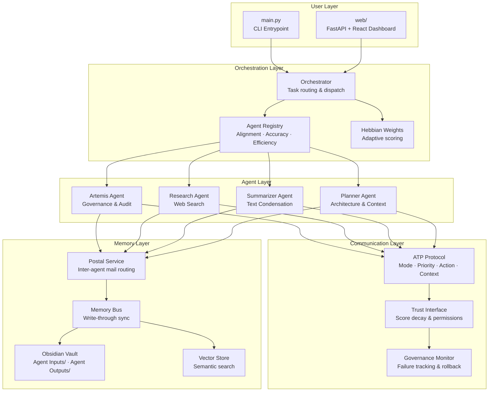

# MCP - Multi-Agent Coordination Platform

A multi-agent orchestration system built around an **Obsidian vault as persistent memory**. Agents communicate via the **Artemis Transmission Protocol (ATP)**, are ranked by **Hebbian-weighted trust scores**, and route tasks through a central orchestrator. A write-through memory bus keeps the vault and a local vector store in sync for both auditable storage and fast semantic recall.

## System Architecture



## Quick Start

```bash
# 1. Install dependencies
pip install -r requirements.txt

# 2. Configure vault path
cp .env.example .env           # then set OBSIDIAN_VAULT_PATH

# 3. Run the platform
python main.py                              # full run with demo tasks
python main.py --skip-demos                 # skip demo note creation
python main.py -i "Summarize X" -c text_summarization
python main.py --agent research_agent -i "Research Y"
python main.py --show-hebbian               # view Hebbian network summary
python main.py --agent-stats artemis        # single-agent stats
```

## Key Concepts

| Concept | Description |
|---|---|
| **ATP** | Structured message headers (`#Mode`, `#Priority`, `#ActionType`, `#Context`) parsed by agents to determine intent and routing |
| **Hebbian Weights** | Agents gain or lose routing priority based on task success/failure history — "neurons that fire together wire together" |
| **Trust Decay** | Agent trust scores decay over time without reinforcement, gating read/write/delete permissions |
| **Memory Bus** | Write-through layer keeping the Obsidian vault (auditable) and vector store (fast semantic recall) in sync |
| **Postal Service** | Inter-agent communication framed as mail delivery — agents are citizens, the vault is the City Archives |
| **Governance Monitor** | Tracks memory-bus failures and emits rollback signals when thresholds are exceeded |
| **Orchestrator** | Reads pending tasks from `Agent Inputs/`, matches `required_capability` to the highest-scored agent, executes, writes results to `Agent Outputs/` |

## Concept Demos

Interactive browser prototypes and CLI walkthroughs in [`Concept_Demos/`](Concept_Demos/README.md). Deployed to Vercel as a static site.

| Demo | Type | What it shows |
|---|---|---|
| `atp_prototype.html` | Browser | ATP message builder, agent routing simulation, trust decay chart with scenario switching |
| `Hebbian_Proto.html` | Browser | Hebbian learning network — agent weights, reinforcement dynamics, live simulation |
| `demo_artemis.py` | CLI | ATP parsing, instruction loading, persona modes, reflection engine, semantic tagging |
| `demo_city_postal.py` | CLI | Inter-agent mail, archive filing, trust clearances (works offline with mocks) |
| `demo_memory_integration.py` | CLI | MCP server connection, trust interface, context loading from Obsidian, trust decay model |

```bash
# Browser demos — serve locally
cd Concept_Demos && python -m http.server 8080
# Then open http://localhost:8080

# CLI demos — run from repo root
python Concept_Demos/demo_artemis.py
python Concept_Demos/demo_city_postal.py
python Concept_Demos/demo_memory_integration.py
```

## Tests

```bash
pytest tests/
```

## Author

Prinston (Apollo) Palmer - Systems Architect
