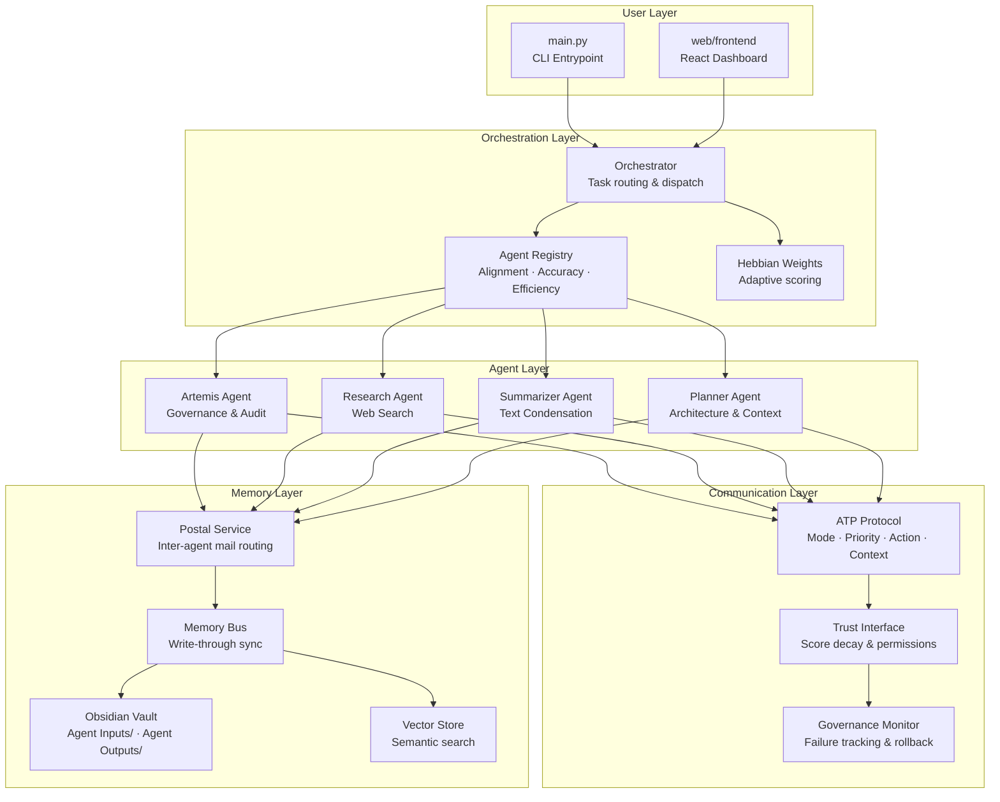

# Agentic Governance Artemis City

Artemis City is an architectural framework designed to align agentic reasoning with transparent, accountable action across distributed intelligence systems—both human and machine. It establishes a governance framework for large-scale multi-agent deployments where transparency is intrinsic rather than retrospective.

The platform is a **Multi-Agent Coordination Platform (MCP)** built around an **Obsidian vault as persistent memory**. Agents communicate via the **Artemis Transmission Protocol (ATP)**, are ranked by **Hebbian-weighted trust scores**, and route tasks through a central orchestrator.

## 🚀 Overview

- **Persistent Memory**: Uses an Obsidian vault as a write-through memory bus.
- **Protocol-Driven**: Agents communicate using structured ATP headers (Mode, Priority, Action, Context).
- **Adaptive Governance**: Trust scores (Hebbian weights) evolve based on agent performance and decay over time.
- **Full Stack**: Includes a Python orchestration engine, a TypeScript/Express API, and a React-based dashboard.

## 🛠 Tech Stack

- **Core Logic**: Python 3.10+ (FastAPI, SQLAlchemy, Pydantic, Pytest)
- **Persistent Storage**: Obsidian (Markdown), SQLite/PostgreSQL, Vector Store
- **Web API**: Node.js, TypeScript, Express
- **Frontend**: React, Vite, Chakra UI, TypeScript
- **Package Managers**: `pip` / `pipenv` (Python), `npm` (Node.js)

## 🏗 System Architecture



## 📁 Project Structure

```text
.
├── main.py                 # Primary Python CLI entry point
├── pyproject.toml          # Python project metadata and dependencies
├── requirements.txt        # Python dependencies
├── Pipfile                 # Pipenv dependency management
├── src/                    # Core Python source code
│   ├── mcp/                # Multi-Agent Coordination Platform logic
│   ├── agents/             # Individual agent implementations
│   ├── core/               # Shared system utilities
│   └── obsidian_integration/ # Obsidian vault connectors
├── web/                    # Web-based interfaces
│   ├── api/                # TypeScript/Express REST API
│   └── frontend/           # React/Vite dashboard
├── Concept_Demos/          # Prototypes and CLI walkthroughs
├── tests/                  # Python test suite
└── docs/                   # Project documentation
```

## ⚙️ Setup & Installation

### Prerequisites
- Python 3.10+
- Node.js 18+
- npm

### 1. Python Environment
```bash
# Clone the repository
git clone <repo-url>
cd repo

# Install dependencies
pip install -r requirements.txt
# OR using pipenv
pipenv install
```

### 2. Configuration
```bash
# Copy environment template
cp .env.example .env

# Edit .env and set your Obsidian vault path and API keys
# OBSIDIAN_VAULT_PATH=/path/to/your/vault
```

### 3. Web API (Optional)
```bash
cd web/api
npm install
npm run build
npm start
```

### 4. Frontend Dashboard (Optional)
```bash
cd web/frontend
npm install
npm run dev
```

## 🏃 Entry Points & Scripts

### Python CLI (`main.py`)
The primary way to interact with the platform:
```bash
# Run with demo tasks
python main.py

# Process a specific instruction
python main.py -i "Summarize the latest research" -c text_summarization

# Use a specific agent
python main.py --agent research_agent -i "Find info on ATP"

# View system stats
python main.py --show-hebbian
python main.py --agent-stats artemis
```

### Web API Scripts
- `npm run dev`: Start API in development mode with auto-reload.
- `npm run build`: Compile TypeScript to JavaScript.
- `npm start`: Run the compiled API.

### Frontend Scripts
- `npm run dev`: Start the Vite development server.
- `npm run build`: Build the production-ready dashboard.

## 🧪 Testing

### Python Tests
```bash
pytest tests/
# With coverage
pytest --cov=src tests/
```

### Web API Tests
```bash
cd web/api
npm test
```

## 🔑 Environment Variables

Relevant variables in `.env`:
- `OBSIDIAN_VAULT_PATH`: Local path to your Obsidian vault.
- `OBSIDIAN_BASE_URL`: URL for Obsidian Local REST API (default: `http://localhost:27124`).
- `OBSIDIAN_API_KEY`: API key for Obsidian integration.
- `MCP_BASE_URL`: Base URL for the MCP server.
- `FASTAPI_API_KEY`: Security key for the FastAPI dashboard.

## 📝 TODOs & Roadmap

- [ ] Implement robust error recovery in the Memory Bus.
- [ ] Expand the Research Agent's web-scraping capabilities.
- [ ] Add real-time WebSocket updates to the React dashboard.
- [ ] Improve vector store indexing for large vaults.
- [ ] Implement formal verification for ATP message headers.

## 📄 License
Apache 2.0 License. See [LICENSE](LICENSE) for details.

## 👥 Author
Prinston (Apollo) Palmer
