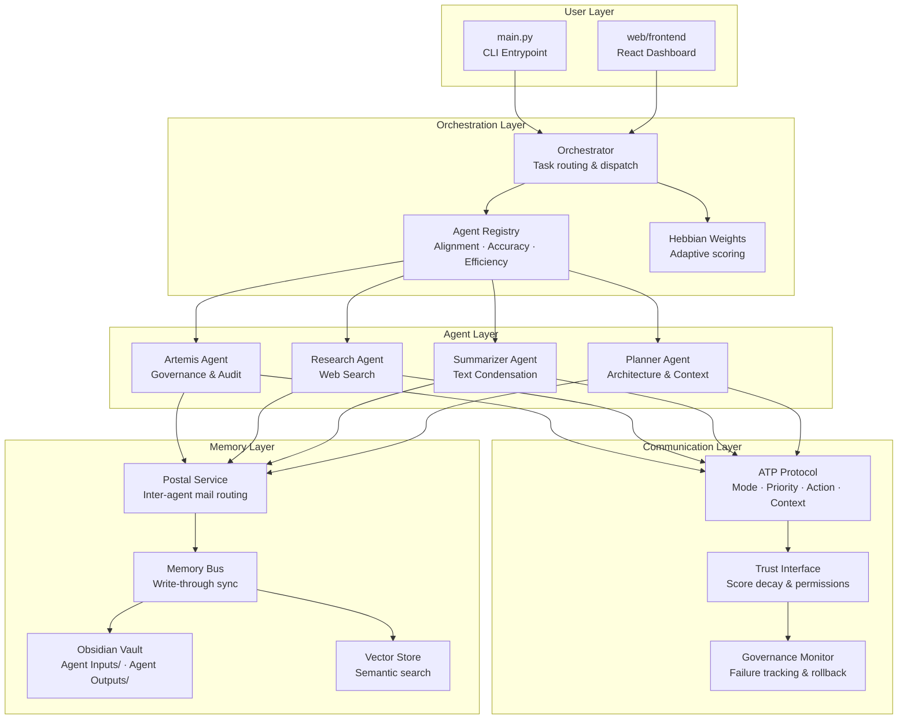

<p><a target="_blank" href="https://app.eraser.io/workspace/9skbTVbh57gG3A6g4mQ4" id="edit-in-eraser-github-link"></a></p>

# Agentic Governance Artemis City
Artemis City is an architectural framework designed to align agentic reasoning with transparent, accountable action across distributed intelligence systems—both human and machine. It establishes a governance framework for large-scale multi-agent deployments where transparency is intrinsic rather than retrospective.

The platform is a **Multi-Agent Coordination Platform (MCP)** built around an **Obsidian vault as persistent memory**. Agents communicate via the **Artemis Transmission Protocol (ATP)**, are ranked by **Hebbian-weighted trust scores**, and route tasks through a central orchestrator.

## 🚀 Overview
- **Persistent Memory**: Uses an Obsidian vault as a write-through memory bus.
- **Protocol-Driven**: Agents communicate using structured ATP headers (Mode, Priority, Action, Context).
- **Adaptive Governance**: Trust scores (Hebbian weights) evolve based on agent performance and decay over time.
- **Full Stack**: Includes a Python orchestration engine, a TypeScript/Express API, and a React-based dashboard.
## 🛠 Tech Stack
- **Core Logic**: Python 3.10+ (FastAPI, SQLAlchemy, Pydantic, Pytest)
- **Persistent Storage**: Obsidian (Markdown), SQLite/PostgreSQL, Vector Store
- **Web API**: Node.js, TypeScript, Express
- **Frontend**: React, Vite, Chakra UI, TypeScript
- **Package Managers**: `pip`  / `pipenv`  (Python), `npm`  (Node.js)
## 🏗 System Architecture

```mermaid
graph TB
subgraph User["User Layer"]
    CLI["main.py<br/>CLI Entrypoint"]
    WebUI["web/frontend<br/>React Dashboard"]
end

subgraph Orchestration["Orchestration Layer"]
    ORC["Orchestrator<br/>Task routing & dispatch"]
    REG["Agent Registry<br/>Alignment · Accuracy · Efficiency"]
    HEB["Hebbian Weights<br/>Adaptive scoring"]
end

subgraph Agents["Agent Layer"]
    ART["Artemis Agent<br/>Governance & Audit"]
    RES["Research Agent<br/>Web Search"]
    SUM["Summarizer Agent<br/>Text Condensation"]
    PLN["Planner Agent<br/>Architecture & Context"]
end

subgraph Protocol["Communication Layer"]
    ATP["ATP Protocol<br/>Mode · Priority · Action · Context"]
    TRUST["Trust Interface<br/>Score decay & permissions"]
    GOV["Governance Monitor<br/>Failure tracking & rollback"]
end

subgraph Memory["Memory Layer"]
    OBS["Obsidian Vault<br/>Agent Inputs/ · Agent Outputs/"]
    VEC["Vector Store<br/>Semantic search"]
    BUS["Memory Bus<br/>Write-through sync"]
    POST["Postal Service<br/>Inter-agent mail routing"]
end

CLI --> ORC
WebUI --> ORC
ORC --> REG
ORC --> HEB
REG --> ART & RES & SUM & PLN
ART & RES & SUM & PLN --> ATP
ATP --> TRUST
TRUST --> GOV
ART & RES & SUM & PLN --> POST
POST --> BUS
BUS --> OBS
BUS --> VEC
```
## 📁 Project Structure
```text
.
├── main.py                 # Primary Python CLI entry point
├── pyproject.toml          # Python project metadata and dependencies
├── requirements.txt        # Python dependencies
├── Pipfile                 # Pipenv dependency management
├── Makefile                # Automation for setup and common tasks
├── src/                    # Core source code
│   ├── Agent Inputs/       # Obsidian integration input folder
│   ├── Architecture/       # Framework design and specs
│   ├── Kernel/             # Core logic and agent implementations
│   ├── agents/             # Modular agent directory (artemis, atp, etc.)
│   ├── core/               # Shared system utilities and instructions
│   ├── governance/         # Trust and security modules
│   ├── interface/          # Terminal and CLI UI components
│   ├── mcp/                # Multi-Agent Coordination Platform logic
│   ├── mcp-server/         # TypeScript-based MCP server implementation
│   ├── obsidian_integration/ # Obsidian vault connectors and generators
│   └── utils/              # General helper functions
├── web/                    # Web-based interfaces
│   ├── api/                # TypeScript/Express REST API
│   └── frontend/           # React/Vite dashboard
├── Concept_Demos/          # Interactive prototypes and CLI walkthroughs
├── tests/                  # Python test suite
├── scripts/                # Utility scripts (setup, deployment)
├── monitoring/             # System health and logging configurations
└── docs/                   # Project documentation and guidelines
```
## 🎨 Concept Demos
Explore the core features of Artemis City through interactive prototypes and walkthrough scripts. The `Concept_Demos/` directory is a self-contained demonstration environment with its own agent implementations, database backends, and orchestration logic.

### Browser Prototypes
Self-contained React-based interactive demos (no server required).

1. **ATP Prototype** (`atp_prototype.html` ): Four interactive tabs
    - Message Builder with real-time ATP header validation
    - Agent Routing simulator (keyword-based routing to Artemis, Planner, Pack Rat, Codex Daemon)
    - Trust Decay visualization (4 scenarios over 30 days)
    - Full workflow animation (5-step ATP message lifecycle)

2. **Hebbian Network** (`Hebbian_Proto.html` ): Live visualization of agent connection strengths, Hebbian weight evolution, and reinforcement dynamics.
3. **Landing Page** (`index.html` ): Card-based hub with links to all demos and run instructions.
To run locally:

```bash
cd Concept_Demos && python3 -m http.server 8080
# Open http://localhost:8080
```
### CLI Walkthroughs
Interactive Python demonstrations with step-through prompts. These demos are **self-contained** and include their own agent implementations under `Concept_Demos/src/`.

- `**demo_artemis.py**` : ATP protocol parsing, instruction hierarchy, Artemis persona response modes, reflection engine, and semantic tagging with citations.
- `**demo_city_postal.py**` : Inter-agent mail delivery, mailbox checking, City Archives filing, and trust clearance matrix. Works offline via mocks.
- `**demo_memory_integration.py**` : MCP server health check, trust interface with permission matrix, Obsidian context loading, and integrated agent-vault workflow with trust decay model. Skips MCP-only flows gracefully if server unavailable.
- `**main.py**` : Full orchestrator CLI for task routing, agent assignment, Hebbian network stats, and Obsidian integration (requires MCP server and vault setup).
To run:

```bash
# Run from the repository root
python3 Concept_Demos/demo_artemis.py
python3 Concept_Demos/demo_city_postal.py
python3 Concept_Demos/demo_memory_integration.py

# Full orchestrator (requires setup)
python3 Concept_Demos/main.py --show-hebbian
python3 Concept_Demos/main.py --agent-stats artemis
```
See [Concept_Demos/README.md](Concept_Demos/README.md) for detailed feature descriptions and usage.

#### Deploy Browser Demos
The browser demos can be deployed to free hosting:

```bash
# Deploy to Vercel (recommended)
cd Concept_Demos && npx vercel --prod

# Or use GitHub Pages (see docs/BROWSER_DEMOS_DEPLOYMENT.md)
```
See [Browser Demos Deployment Guide](docs/BROWSER_DEMOS_DEPLOYMENT.md) for detailed instructions.

## ⚙️ Setup & Installation
### Prerequisites
- Python 3.10+
- Node.js 18+
- npm
### 1. Python Environment
```bash
# Clone the repository
git clone <repo-url>
cd repo

# Install dependencies
pip install -r requirements.txt
# OR using pipenv
pipenv install
```
### 2. Configuration
```bash
# Copy environment template
cp .env.example .env

# Edit .env and set your Obsidian vault path and API keys
# OBSIDIAN_VAULT_PATH=/path/to/your/vault
```
### 3. Web API (Optional)
```bash
cd web/api
npm install
npm run build
npm start
```
### 4. Frontend Dashboard (Optional)
```bash
cd web/frontend
npm install
npm run dev
```
## 🏃 Entry Points & Scripts
### Python CLI (`main.py`)
The primary way to interact with the platform:

```bash
# Run with demo tasks
python main.py

# Process a specific instruction
python main.py -i "Summarize the latest research" -c text_summarization

# Use a specific agent
python main.py --agent research_agent -i "Find info on ATP"

# View system stats
python main.py --show-hebbian
python main.py --agent-stats artemis
```
### Web API Scripts
- `npm run dev` : Start API in development mode with auto-reload.
- `npm run build` : Compile TypeScript to JavaScript.
- `npm start` : Run the compiled API.
### Frontend Scripts
- `npm run dev` : Start the Vite development server.
- `npm run build` : Build the production-ready dashboard.
## 🧪 Testing
### Python Tests
```bash
pytest tests/
# With coverage
pytest --cov=src tests/
```
### Web API Tests
```bash
cd web/api
npm test
```
## 🔑 Environment Variables
Relevant variables in `.env`:

- `OBSIDIAN_VAULT_PATH` : Local path to your Obsidian vault.
- `OBSIDIAN_BASE_URL` : URL for Obsidian Local REST API (default: `http://localhost:27124` ).
- `OBSIDIAN_API_KEY` : API key for Obsidian integration.
- `MCP_BASE_URL` : Base URL for the MCP server.
- `FASTAPI_API_KEY` : Security key for the FastAPI dashboard.
## 📝 TODOs & Roadmap
- [ ] Implement robust error recovery in the Memory Bus
- [ ] Expand the Research Agent's web-scraping capabilities
- [ ] Add real-time WebSocket updates to the React dashboard
- [ ] Improve vector store indexing for large vaults
- [ ] Implement formal verification for ATP message headers
- [ ] Create unified agent implementation guide bridging Concept_Demos and main src/
- [ ] Add integration tests between Concept_Demos and main orchestrator
- [ ] Document migration path from Concept_Demos prototypes to production agents
- [ ] Deploy browser demos to Vercel or GitHub Pages for easy public access
## 📄 License
MIT License. See [LICENSE](LICENSE) for details.

## 👥 Author
Prinston (Apollo) Palmer


<!--- Eraser file: https://app.eraser.io/workspace/9skbTVbh57gG3A6g4mQ4 --->