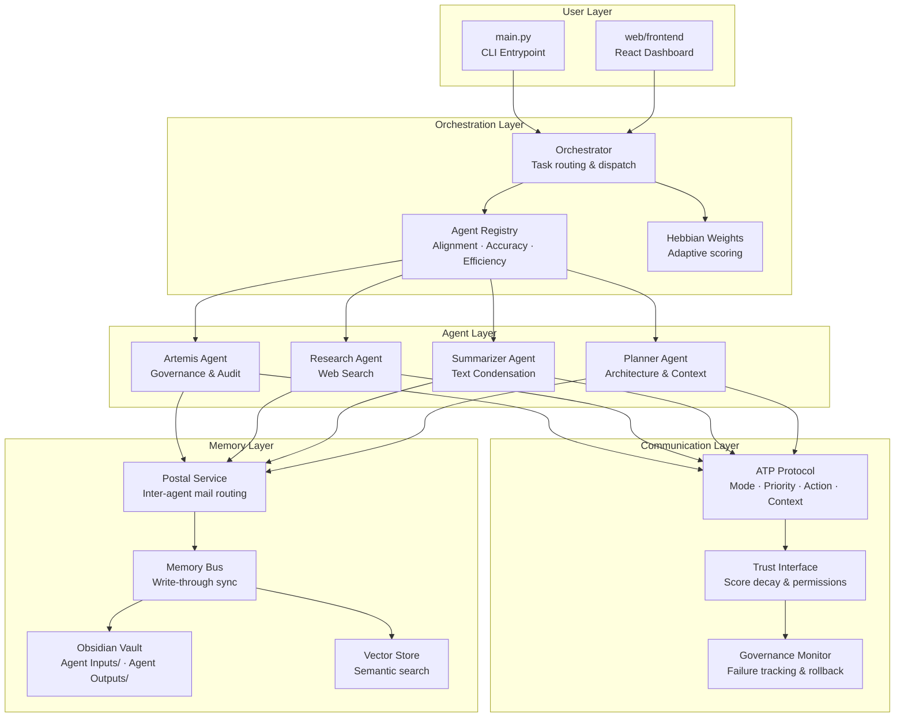

<p><a target="_blank" href="https://app.eraser.io/workspace/9skbTVbh57gG3A6g4mQ4" id="edit-in-eraser-github-link"></a></p>

# Artemis City

Artemis City is an architectural framework designed to align agentic reasoning with transparent, accountable action across distributed intelligence systems—both human and machine. It establishes a governance framework for large-scale multi-agent deployments where transparency is intrinsic rather than retrospective.

The platform is a **Multi-Agent Coordination Platform (MCP)** built around an **Obsidian vault as persistent memory**. Agents communicate via the **Artemis Transmission Protocol (ATP)**, are ranked by **Hebbian-weighted trust scores**, and route tasks through a central orchestrator.

## 🚀 Overview

- **Persistent Memory**: Uses an Obsidian vault as a write-through memory bus.
- **Protocol-Driven**: Agents communicate using structured ATP headers (Mode, Priority, Action, Context).
- **Adaptive Governance**: Trust scores (Hebbian weights) evolve based on agent performance and decay over time.
- **Full Stack**: Includes a Python orchestration engine, a TypeScript/Express API, and a React-based dashboard.

## 🛠 Tech Stack

- **Core Logic**: Python 3.10+ (FastAPI, SQLAlchemy, Pydantic, Pytest)
- **Persistent Storage**: Obsidian (Markdown), SQLite/PostgreSQL, Vector Store
- **Web API**: Node.js, TypeScript, Express
- **Frontend**: React, Vite, Chakra UI, TypeScript
- **Package Managers**: `pip`  / `pipenv`  (Python), `npm`  (Node.js)

## Table of Contents

1. [Project Overview](#project-overview)
2. [Core Philosophy & Principles](#core-philosophy--principles)  /
3. [Repository Structure](#repository-structure)
4. [Agent System Architecture](#agent-system-architecture)
5. [Key Protocols & Models](#key-protocols--models)
6. [Development Workflows](#development-workflows)
7. [Coding Conventions](#coding-conventions)
8. [Important Files Reference](#important-files-reference)
9. [Working with This Codebase](#working-with-this-codebase)
10. [Communication Patterns](#communication-patterns)

## 🏗 System Architecture beyond Demo


```mermaid
graph TB
subgraph User["User Layer"]
    CLI["main.py<br/>CLI Entrypoint"]
    WebUI["web/frontend<br/>React Dashboard"]
end

subgraph Orchestration["Orchestration Layer"]
    ORC["Orchestrator<br/>Task routing & dispatch"]
    REG["Agent Registry<br/>Alignment · Accuracy · Efficiency"]
    HEB["Hebbian Weights<br/>Adaptive scoring"]
end

subgraph Agents["Agent Layer"]
    ART["Artemis Agent<br/>Governance & Audit"]
    RES["Research Agent<br/>Web Search"]
    SUM["Summarizer Agent<br/>Text Condensation"]
    PLN["Planner Agent<br/>Architecture & Context"]
end

subgraph Protocol["Communication Layer"]
    ATP["ATP Protocol<br/>Mode · Priority · Action · Context"]
    TRUST["Trust Interface<br/>Score decay & permissions"]
    GOV["Governance Monitor<br/>Failure tracking & rollback"]
end

subgraph Memory["Memory Layer"]
    OBS["Obsidian Vault<br/>Agent Inputs/ · Agent Outputs/"]
    VEC["Vector Store<br/>Semantic search"]
    BUS["Memory Bus<br/>Write-through sync"]
    POST["Postal Service<br/>Inter-agent mail routing"]
end

CLI --> ORC
WebUI --> ORC
ORC --> REG
ORC --> HEB
REG --> ART & RES & SUM & PLN
ART & RES & SUM & PLN --> ATP
ATP --> TRUST
TRUST --> GOV
ART & RES & SUM & PLN --> POST
POST --> BUS
BUS --> OBS
BUS --> VEC
```

# Mission Statement

Focus on future-proofing the world of data from the backend to frontend applications. For an extended period, there has been a disconnect between those who build servers and those who develop applications. This disconnect has been intensifying as quantum computing gains power, and it is not an exaggeration to predict that all encryption will become obsolete in a relatively short timeframe.

Governance principles within artificial intelligence (AI) must be formalized into a robust structure. Constraints are often misunderstood as detrimental to the AI space, which hinders the full potential of AI in a purely economic sense. The economic aspects of agents and data are not adequately explored.

**For those who have ideas that resonate deeply within themselves but may not be immediately comprehensible to others, these ideas hold the potential to make a significant impact, and cripple yout ability to build and ship, this one is for you. A platform where you dont have to be loud to be heard, but always crystal clear. I got burned to let you know it only hurts if you learn nothing, just like you already thought, but didnt know why.

---

## Core Philosophy & Principles

The project follows the **Agent_0 Manifesto** (`Agent_0/manifesto.md`), which establishes these core tenets:

### 1. Build from experience, clarity only comes from iterating through noise

- The Agent_manifesto is a living document, one that will change as platform adopts more Agents and other planned features are rolled out.
- Evolves with understanding and experience
- Embrace continuous improvement

### 2. **Net Good Over Noise**

- Prioritize actions that contribute positively to system goals
- Filter information through ethical boundaries
- Focus on meaningful contributions
- Build in public, mistakes and best practices are meant to be explored safely or with risk acceptance.

### 3. **Transparent Accountability**

- Every agent's actions are auditable and attributable
- Clear documentation of roles and responsibilities
- Traceable decision-making processes

### 4. **Collaborative Autonomy**

- Agents operate with defined autonomy within a collaborative framework
- Clear boundaries prevent scope creep
- Interdependencies are explicitly defined
- Agents do not call each other, collaboration through the Kernel

### 5. **Resilience through Entropy Management**

- Acknowledge natural decay and drift in complex systems
- Implement countermeasures proactively
- Use Trust Decay Model to manage reliability
- Constraints will create the market not yet seen

---

## Repository Structure

```
Artemis-City/
│
├── agents/                    # Agent definitions and specifications
│   ├── agent_template.md      # Template for creating new agents
│   ├── artemis.md            # Mayor protocol, governance agent
│   ├── planner.md            # Companion, elastic augmentation agent
│   ├── pack_rat.md           # Courier role, secure data transfer agent
│   └── Agent_0_daemon.md       # System anchor, memory interface agent
│
├── Agent_0/                     # Core principles and philosophy
│   └── manifesto.md          # Foundational principles document
│
├── interface/                 # User-facing components
│   ├── Agent_0_cli.py          # Main CLI for interacting with agents
│   ├── agent_router.yaml     # Keyword-based routing configuration
│   └── translator_protocol.md # Communication encoding standards
│
├── launch/                    # Governance and release management
│   ├── open_source_covenant.md # Open source principles
│   └── release_gatecheck.md   # Release validation criteria
│
├── memory/                    # Memory management frameworks
│   ├── trust_decay_model.md  # Trust scoring and decay mechanics
│   ├── memory_lawyer.md      # Memory validation protocols
│   └── validation_simulations.md # Testing frameworks
│
├── sandbox_city/             # Simulation environment
│   ├── index.md              # Overview of sandbox environment
│   ├── semantic_zones.md     # Zone definitions
│   └── networked_scripts/
│       └── mail_delivery_sim.py # Secure mail transfer simulation
│
├── .gitignore                # Comprehensive ignore patterns
├── LICENSE                   # MIT License
├── README.md                 # User-facing documentation
├── requirements.txt          # Python dependencies (PyYAML>=6.0)
├── package.json              # Project metadata
├── pyproject.toml            # Python project configuration
└── uv.lock                   # Dependency lock file
## 🎨 Concept Demos

Explore the core features of Artemis City through interactive prototypes and walkthrough scripts. The `Concept_Demos/` directory is a self-contained demonstration environment with its own agent implementations, database backends, and orchestration logic.

### Browser Prototypes

Self-contained React-based interactive demos (no server required).

1. **ATP Prototype** (`atp_prototype.html` ): Four interactive tabs
    - Message Builder with real-time ATP header validation
    - Agent Routing simulator (keyword-based routing to Artemis, Planner, Pack Rat, Codex Daemon)
    - Trust Decay visualization (4 scenarios over 30 days)
    - Full workflow animation (5-step ATP message lifecycle)

2. **Hebbian Network** (`Hebbian_Proto.html` ): Live visualization of agent connection strengths, Hebbian weight evolution, and reinforcement dynamics.
3. **Landing Page** (`index.html` ): Card-based hub with links to all demos and run instructions.

To run locally:

```bash
cd Concept_Demos && python3 -m http.server 8080
# Open http://localhost:8080
```

### CLI Walkthroughs

Interactive Python demonstrations with step-through prompts. These demos are **self-contained** and include their own agent implementations under `Concept_Demos/src/`.

- `**demo_artemis.py**`  : ATP protocol parsing, instruction hierarchy, Artemis persona response modes, reflection engine, and semantic tagging with citations.
- `**demo_city_postal.py**`  : Inter-agent mail delivery, mailbox checking, City Archives filing, and trust clearance matrix. Works offline via mocks.
- `**demo_memory_integration.py**`  : MCP server health check, trust interface with permission matrix, Obsidian context loading, and integrated agent-vault workflow with trust decay model. Skips MCP-only flows gracefully if server unavailable.
- `**main.py**`  : Full orchestrator CLI for task routing, agent assignment, Hebbian network stats, and Obsidian integration (requires MCP server and vault setup).
To run:

```bash
# Run from the repository root
python3 Concept_Demos/demo_artemis.py
python3 Concept_Demos/demo_city_postal.py
python3 Concept_Demos/demo_memory_integration.py

# Full orchestrator (requires setup)
python3 Concept_Demos/main.py --show-hebbian
python3 Concept_Demos/main.py --agent-stats artemis
```

See [Concept_Demos/README.md](Concept_Demos/README.md) for detailed feature descriptions and usage.

---

## Agent System Architecture

### Agent Definition Framework

All agents follow a standardized template (`agents/agent_template.md`) with these required fields:

| Field | Description |
| ----- | ----- |
| **Agent Name** | Unique identifier (e.g., "Artemis", "Pack Rat") |
| **System Access Scope** | Boundaries of resource/data access |
| **Semantic Role** | Primary function and purpose |
| **Energy Signature** | Computational footprint (low/moderate/high-compute) |
| **Linked Protocols** | Communication and operational protocols |
| **Drift Countermeasures** | Mechanisms to prevent behavioral deviation |
| **Trust Threshold Triggers** | Conditions that trigger trust re-evaluation |

### Current Agents

#### 1. **Artemis** (Mayor Protocol, Governance)

- **Role:** System overseer, governance, dispute resolution,memory interface, configuration management
- **Access:** Full read access to agent/memory logs, write to governance protocols
- **Energy:** Moderate, event-driven (policy violations, disputes, audits)
- **Keywords:** `artemis` , `governance` , `policy` , `audit` , `dispute` , `review`

#### 2. **planner** (Companion, Elastic Augmentation)

- **Role:** Real-time assistant, contextual information provider
- **Access:** Read current agent context and public memory, write to communication channels
- **Energy:** Moderate, on-demand, scales with interaction
- **Keywords:** `help` , `assist` , `explain` , `augment` , `clarify` , `suggest`

#### 3. **Pack Rat** (Courier Role, Safe Transfer, Only external facing agent)

- **Role:** Secure data transfer between agents/components
- **Access:** Read/write to secure transfer zones, limited read to communication channels
- **Energy:** Low-compute, transaction-based
- **Keywords:** `transfer` , `send` , `receive` , `courier` , `data` , `secure`

#### 4. Agent_0

- **Role:** Execution operations, builder, towns operator
- **Access:** Write access for defined Target area, limited timeframe of access.
- **Energy:** High compute, build on command, order execution
- **Keywords:** build, execute, scaffold, `daemon` , Operator

#### 4. **CompSuite (Sentinel)

- **Role:** System status monitoring, memory interface, configuration management
- **Access:** System-level access to read memory and governance policies
- **Energy:** Dynamic-compute, continuous signal monitoring, pattern awareness
- **Keywords:** `memory` , `system` , watchtower

### Agent Routing Mechanism

The current build is focused on mechanism of movement and autidability, the end values criteria for routing and weighting will be domain dependent. For now it uses keyword-based routing defined in `interface/agent_router.yaml`:

1. User inputs command
2. System matches keywords against agent definitions
3. Command routed to appropriate agent with the same keyword matching and proper weighting
4. Agent performs action within defined scope once task is allocated to by kernel
5. Results returned through the same pipeline back through orchestrated kernel movements.

---

## Key Protocols & Models

### 1. **Trust Decay Model** (`docs/trust_decay_model.md`)

Dynamic trust evaluation framework with these components:

- **Initial Trust Score:** Baseline trust for new agents/memories/protocols
- **Decay Rate:** Natural erosion over time without reinforcement
- **Reinforcement Events:** Successful tasks, validations, protocol adherence increase trust as the foundation. Specific formula will vary by domain use case and
- **Negative Events:** Failures, violations, inconsistencies decrease trust
- **Trust Thresholds:** Trigger re-evaluation, restricted access, or increased scrutiny and human intervention
**Usecase:**

- Agent Trust: Influences resource access and reliability
- Memory Trust: Determines weight given to memory entries
- Protocol Trust: Confidence in protocol effectiveness
- Discrepancy resolution between agents working together on single overall request from user.

### 2. **Translator Protocol** (`interface/translator_protocol.md`)

Ensures consistent communication across languages and encoding systems. This is will be used reduce the risks associated of interpretation of user and agents intent when communicating across languages, not just programming or scripting languages. This accounts for the lack of one to one mapping of human language globally. As it presently stands most agents output some form of Python, and English based language. Whether it is explicitly known, everyone using the current frontier models are communicating in English through python. With the rise of voice use in LLM interactions, this introduces a potential misaligned user and agent understanding.

- **Standard Encoding:** UTF-8 for all internal communications
- **Transliteration Rules:** Algorithms for converting text between writing systems
- **Language Detection:** Identify source language of incoming text
- **Error Reporting:** Automated alerts for encoding/transliteration issues
- **Human Review Loop:** Triggered for known complex or ambiguous cases such as Tonal languages that have no corresponding characters one language to another.

### 3. **Artemis(Agentic) Transmission Protocol (ATP)**

The early naming usage has been Artemis Transmission Protocol as it came from my interaction with single LLM model who went by Artemis. With this improvement to base frontier model seen. It was applied across all agents in my daily workflow, hence the more generic name to represent the ability to drop any model into this protocol and have achieve similar behavior and increased output quality. This resulted into the foundational tags used in ATP, specific domains may require more inputs, but the belief is that this represents the minimum ATP setup when working with more than one Agent on a shared tasked.

Structured communication system with signal tags:

```
| Tag | Purpose |
|-----|---------|
| `#Mode:` | Overall intent (Build, Review, Organize, Capture, Synthesize, Commit) |
| `#Context:` | Brief mission goal or purpose |
| `#Priority:` | Urgency level (Critical, High, Normal, Low) |
| `#ActionType:` | Expected response (Summarize, Scaffold, Execute, Reflect) |
| `#TargetZone:` | Project/folder area for the work |
| `#SpecialNotes:` | Unusual instructions, warnings, or exceptions |
```

---

## Development Workflows

### Setting Up Development Environment

```bash
# 1. Clone repository
git clone 
cd to project directory

# Or use GitHub Pages (see docs/BROWSER_DEMOS_DEPLOYMENT.md)

# 3. Activate virtual environment
# On macOS/Linux:
source venv/bin/activate
# On Windows:

.\venv\Scripts\activate

# 4. Install 

pip install -r requirements.txt
Or pipenv install -e . && pipenv shell 
Or 
UV pip install -requirements.txt 

For development work switch to --dev or
requirements-dev which includes modules from -requirements.txt** 

### Running the CLI

**Interactive Mode similar to current frontier CLI agents:**
```bash
python -m Concept_Demo.kernel.Artemis_CLI
```

**Command Mode:**

```bash
python interface/Agent_0_cli.py "ask artemis about system status"
```

### Running Simulations

```bash
python sandbox_city/networked_scripts/mail_delivery_sim.py
```

### Testing Workflow

Currently, the project uses manual testing:

- Test CLI routing with various commands
- Run simulations to verify agent interactions
- Validate protocol compliance manually

---

## Coding Conventions

### Python Style Guidelines

1. **Documentation:**
    - Use Google-style docstrings for all public functions
    - Document module-level functionality

2. **Code Organization:**
    - Keep functions focused and single-purpose
    - Use descriptive variable and function names
    - Maintain clear separation of concerns

3. **Error Handling:**

- Errors should be highlighted in the process prior to final output
- Agents never call another agent directly to discuss errors or workarounds. Output returned to kernel for review
- Sentinel review can be triggered if interaction introduces misalignment between agents actions and ATP intent and output signals
- Human intervention will come during or after outcome depending on complexity
- human based review of all issues in the initial agent onboarding phase.

1. **Configuration:**
    - Use markdown for configuration files.
    - version 1 will have yaml based instruction files. These can be placed in the Agent queue (Postal Office) each full turn ends with review for pending tasks and along with logs and output.
    - Keep configuration separate from code
    - Validate configuration on load
    - Agent config will be stored in agent registry for Kernel reference, introducing an agent does not require changes to data structure, agents not on this list and partial setup anywhere else is viewed as invalid and not in scope for keyword and later capability based routing. The current agents handle task and platform maintenance and are invoked for al queries, in full production the specific agents may change but roles are always needed. Similar to how a government changes Mayors, President this can changed to achieve net good, but dissolving governmental bodies is not allowed.

### Agent Definition Conventions

When creating new agents:

1. Copy `agents/agent_template.md`
2. Fill in all required fields completely
3. Ensure semantic role is clear and concise
4. Define precise access boundaries
5. Specify concrete drift countermeasures
6. List specific trust threshold triggers
7. Update `interface/agent_router.yaml`  with keywords
8. Once reviewed this should be added to the backend agent registry database for actual implementation.
9. Agents base score is met through proven sandboxed task completion prior to registry approval or task routing

### File Naming Conventions

- **Agents:** lowercase with underscores (e.g., `pack_rat.md` )
Code allows for abbreviate to accomodate the common alternatives a user may intentionally or unintentionally enter.
Through ATP validation process, confirming the structure of prompt meets the postal minimum. Similar to sending a letter with no stamp, its returned to sender, alternatively natural language can be used and agent will try to parse input as intend to align with thefields mentinoned,
if ambiguous, escalation is to ask follow up questions, and provide completed ATP details to ensure understanding was correct.

- **Python scripts:** lowercase with underscores (e.g., `Agent_0_cli.py` )
- **Documentation:** lowercase with underscores (e.g., `trust_decay_model.md` )
- **Configuration:** lowercase with underscores (e.g., `agent_router.yaml` )
 --As we introduce Hebbian structure, yaml files are not utilized in flow, the registry becomes the source of all agent details.

---

## Important Files Reference

### Configuration Files

| File | Purpose | Format |
| ----- | ----- | ----- |
| `agent_router.yaml`  | Agent keyword routing | YAML |
| `requirements.txt && -dev.txt`  | Python dependencies | Text |
| `pyproject.toml`  | Python project config | TOML |
| `.gitignore` | Version control exclusions | Text |

| `name.persona.py` | Agent personality user interaction layer (Base agent default)| py |

- `OBSIDIAN_VAULT_PATH`  : Local path to your Obsidian vault.
- `OBSIDIAN_BASE_URL`  : URL for Obsidian Local REST API (default: `http://localhost:27124`  ).
- `OBSIDIAN_API_KEY`  : API key for Obsidian integration.
- `MCP_BASE_URL`  : Base URL for the MCP server.
- `FASTAPI_API_KEY`  : Security key for the FastAPI dashboard.

## 📝 TODOs & Roadmap

- [ ] Implement robust error recovery in the Memory Bus
- [ ] Expand the Research Agent's web-scraping capabilities
- [ ] Add real-time WebSocket updates to the React dashboard
- [ ] Improve vector store indexing for large vaults
- [ ] Implement formal verification for ATP message headers
- [ ] Create unified agent implementation guide bridging Concept_Demos and main src/
- [ ] Add integration tests between Concept_Demos and main orchestrator
- [ ] Document migration path from Concept_Demos prototypes to production agents
- [ ] Deploy browser demos to Vercel or GitHub Pages for easy public access

## 📄 License

MIT License. See [LICENSE](LICENSE) for details.

### Documentation Files

| File | Purpose |
| ----- | ----- |
| `./README`  | User-facing project documentation |
| `Concept_Demos/README`  | User-facing documentation specific to the demo files and artifacts |
| `City_Archive/canon/manifesto.md`  | Core principles and philosophy |
| `agents/agent_template.md`  | Template for new agents |
| `City_Archive/launch/open_source_covenant.md`  | Open source principles |
| `City_Archive/interface/translator_protocol.md`  | Communication standards |
| `City_Archive/eindapapt memory/trust_decay_model.md`  | Trust scoring mechanics |

### Executable Files

| File | Purpose |
| ----- | ----- |
| `Concept_Demos/main.py`  | Main CLI entry point |
| `Concept_Demos/mail_delivery_sim.py`  | Mail delivery simulation |

---

## Project Status & Roadmap

### Current State (Version 0.1.0)

**Completed:**

- ✅ Agent architecture framework
- ✅ Basic CLI with keyword routing
- ✅ Core documentation (Manifesto, protocols, templates)
- ✅ Trust Decay Model definition
- ✅ Sandbox simulation environment
- ✅ Initial agent definitions (Artemis, planner, Pack Rat, CompSuite)
**In Progress:**

- 🔄 Memory management implementation
- 🔄 Trust scoring system implementation
- 🔄 Expanded simulation scenarios
**Planned:**

- ⏳ Automated testing infrastructure
- ⏳ Contributing guidelines (`CONTRIBUTING.md` )
- ⏳ Advanced agent interactions
- ⏳ External API integrations
- ⏳ Enhanced security protocols
- ⏳ Enhanced security protocols
- ⏳ language and runtime refactoring
 Move to integrate more modern handlers and languages such as go, rust, expanded ATP and planned protocols may need to be supported by language or structure not present in this repo as yet to avoid confusion.

### Known Limitations

1. **No Automated Tests:** Test infrastructure needs implementation
2. **Simulated Routing:** CLI routing is keyword-based simulation, not full agent execution
3. **Manual Trust Management:** Trust Decay Model defined but not automated
4. **Limited Simulations:** Only mail delivery simulation currently implemented
5. **Build evolution led to stale code residing in repo and may cause namespace conflicts with most recent setup. As the build became more encompassing package handlers once useful ---

### Key Concepts to Understand

1. **Agentic Reasoning:** Decision-making processes distributed across specialized agents
2. **Trust Decay:** Quantitative trust scoring that changes over time and with interactions
3. **Semantic Zones:** Conceptual areas within Sandbox City for testing
4. **Drift Countermeasures:** Mechanisms to prevent agent behavior deviation
5. **Energy Signatures:** Computational resource footprints of agents
6. Morphological Computation
7. Embodied Cognition
8. Cognetive Morpheogensis

## Efficency of ATP and multiAgent coordination platform quantitive validation simualtion data is currently being refactored into digestable public artifiact and will be avialable for critique and replication. OpenAIs Prism or Googles Colab will be able to run files and replicate

---

## Maintenance Notes

### For AI Assistants

**This file should be updated when:**

- New agents are added
- Agent definitions significantly change
- New protocols are introduced
- Major architectural changes occur
- Dependencies are added or updated
- Project version changes
**Keep this file:**

- Comprehensive but focused
- Clear and accessible
- Aligned with actual codebase state
- Updated with each major change
-
- MIT License:** [https://opensource.org/licenses/MIT](https://opensource.org/licenses/MIT)
- Applies to this specific integration of platform concepts, other portions of code under varying levels of Rights protection.
The Below are being replaced with codign principles based on the C++ adhoc languge made for the F-35 JSF public PDF produced for that specific usecase and adopted to AI. Current codebase has initial consideration but pending full integration into this style where posssible.

- **PyYAML Documentation:** [https://pyyaml.org/](https://pyyaml.org/)
- **Google Python Style Guide:** [https://google.github.io/styleguide/pyguide.html](https://google.github.io/styleguide/pyguide.html)

# next phase of build currently under validation, allowing for API use and live inference model testing

```text
.
├── main.py                 # Primary Python CLI entry point
├── pyproject.toml          # Python project metadata and dependencies
├── requirements.txt        # Python dependencies
├── Pipfile                 # Pipenv dependency management
├── Makefile                # Automation for setup and common tasks
├── src/                    # Core source code
│   ├── Agent Inputs/       # Obsidian integration input folder
│   ├── Architecture/       # Framework design and specs
│   ├── Kernel/             # Core logic and agent implementations
│   ├── agents/             # Modular agent directory (artemis, atp, etc.)
│   ├── core/               # Shared system utilities and instructions
│   ├── governance/         # Trust and security modules
│   ├── interface/          # Terminal and CLI UI components
│   ├── mcp/                # Multi-Agent Coordination Platform logic
│   ├── mcp-server/         # TypeScript-based MCP server implementation
│   ├── obsidian_integration/ # Obsidian vault connectors and generators
│   └── utils/              # General helper functions
├── web/                    # Web-based interfaces
│   ├── api/                # TypeScript/Express REST API
│   └── frontend/           # React/Vite dashboard
├── Concept_Demos/          # Interactive prototypes and CLI walkthroughs
├── tests/                  # Python test suite
├── scripts/                # Utility scripts (setup, deployment)
├── monitoring/             # System health and logging configurations
└── docs/                   # Project documentation and guidelines
```

**Version History:**

- **1.0.0** (2025-11-14): comprehensive Agents.md created by Claude under personal repo, prior to official org formation. Building in public is messay when not classically trained as Dev, this learning and build choice, is on purpose, learn by doing and supplement known outcomes as validation, both of ones own failures and validity of exisitng correct process posture. Has this led to issues, yes mainly outward view of sloppy commits, seemingly half baked. But the 4E's of intelligence dictate, that being right is not as valuable as exploation and failure. This was built from all the thigns that wnet wrong not listening to these principles. Getting burned so the world has marshmellows.

---

**Last Updated:** 2025-11-14
**Document Version:** 1.0.0
**Codebase Version:** 0.1.0
**Maintained By:** Prinston (Apollo) Palmer & various frontier AI Assistants. We welcome brave and noble, understanding socratic partners. on Our journey to Hugging Face for next phase.

<!-- eraser-additional-content -->
## Diagrams
<!-- eraser-additional-files -->
<a href="/README-Multi-Agent Coordination Platform (MCP)-1.eraserdiagram" data-element-id="_E_Orsk6lH41v3KDLFs3t"></a>
<!-- end-eraser-additional-files -->
<!-- end-eraser-additional-content -->
<!--- Eraser file: https://app.eraser.io/workspace/9skbTVbh57gG3A6g4mQ4 --->