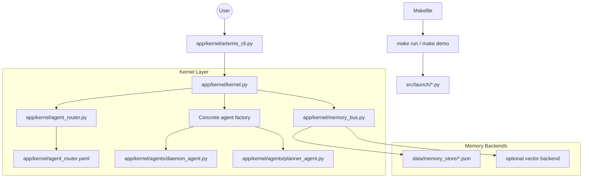
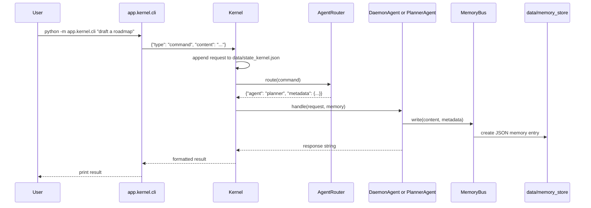

# Artemis Kernel Architecture & Specification

This document describes the maintained in-process kernel under `app/kernel/`.
It is a lightweight local probing surface for Artemis City: a CLI creates
request dictionaries, the kernel routes them by keyword, a concrete agent
handles the request, and the memory bus records the interaction.

Prototype CLI flows have been consolidated under `src/launch/`. The historical
`Concept_Demos/` directory now contains static browser prototypes plus tiny
compatibility shims for older commands; it no longer owns runtime Python
implementations, integration modules, or a frontend workspace.

For the authoritative Python orchestration core, bridge, governance, and memory
bus specs, see `docs/ARCHITECTURE.md`, `docs/API_REFERENCE.md`, and
`docs/MEMORY_BUS.md`.

## 1. Technical Architecture Diagram



## 2. Active Components

- `app/kernel/cli.py`: compatibility entry point for `python -m app.kernel.cli`.
- `app/kernel/artemis_cli.py`: maintained CLI for one-shot commands, plan-file
  requests, and interactive mode.
- `app/kernel/kernel.py`: bootstraps state, router, memory bus, and concrete
  agent dispatch.
- `app/kernel/agent_router.py`: loads `agent_router.yaml` and routes commands
  with keyword-boundary matching.
- `app/kernel/memory_bus.py`: writes/reads memory through local JSON files by
  default; vector support is optional.
- `app/kernel/agents/base.py`: abstract `Agent.handle(request, memory)` contract.
- `app/kernel/agents/daemon_agent.py`: default command handler and fallback.
- `app/kernel/agents/planner_agent.py`: lightweight plan-drafting handler.
- `src/launch/`: maintained CLI walkthroughs and orchestration launch scripts.
- `Concept_Demos/`: static browser prototypes and compatibility shims only.

The router config may name personas that do not yet have concrete classes.
`Kernel._get_agent_instance()` falls back to `DaemonAgent` for those routes and
prints that fallback so the gap stays visible.

## 3. Run-Time Execution Pipeline



## 4. Kernel Responsibilities

### 4.1 Command Processing

- Accepts dictionary requests from the CLI.
- Supports `type: "command"` for routed command handling.
- Supports `type: "exec"` as a placeholder plan-file execution path.
- Appends each request to `data/state_kernel.json` for simple local auditability.

### 4.2 Agent Routing

- Loads `app/kernel/agent_router.yaml`.
- Matches configured keywords against the command with word-boundary regexes.
- Defaults to the `daemon` route when no keyword matches.

### 4.3 Agent Dispatch

- Instantiates `PlannerAgent` for the `planner` route.
- Instantiates `DaemonAgent` for the `daemon` route.
- Falls back to `DaemonAgent` for configured-but-unimplemented routes.

### 4.4 Memory Persistence

- Uses `FileMemoryBackend` by default.
- Writes timestamped JSON entries under `data/memory_store/`.
- Accepts optional custom backends through `MemoryBus`.

## 5. Python Version & Environment Policy

Artemis City standardizes on **Python 3.12** for local development, CI, and
containerized Python surfaces. The repo supports two environment paths only:

1. `uv` managing the `.venv` environment.
2. A conventional `.venv` created with `venv` or `virtualenv`, with packages
   still installed through `uv pip`.

Do not add new setup instructions for conda, poetry, pyenv-specific ranges, or
direct pip-only installation.

## 6. Boot Sequence

From the repository root:

```bash
make install-dev
python -m app.kernel.cli "system status"
```

To target an existing Python 3.12 environment while keeping the root Makefile
as the dependency owner:

```bash
VENV=/absolute/path/to/.venv PYTHON=/absolute/path/to/.venv/bin/python make install-dev
python -m app.kernel.cli "system status"
```

## 7. File Structure Mapping

```text
app/kernel/
├── __init__.py
├── agent_router.py
├── agent_router.yaml
├── artemis_cli.py
├── cli.py
├── kernel.py
├── memory_bus.py
└── agents/
    ├── __init__.py
    ├── base.py
    ├── daemon_agent.py
    └── planner_agent.py
```

## 8. Notes For Future Kernel Work

- Keep the kernel layer small and local; do not reimplement the authoritative
  orchestrator, governance registry, or TypeScript bridge behavior here.
- When adding a concrete kernel agent, add it under `app/kernel/agents/`, update
  `Kernel._get_agent_instance()`, and add focused tests for the route.
- If kernel behavior graduates into the main orchestration core, document the
  boundary change in `docs/ARCHITECTURE.md` and keep this page scoped to the
  `app/kernel/` implementation.
- Do not add new Python implementation flows under `Concept_Demos/`; put
  runnable walkthroughs in `src/launch/` and production behavior in `src/`.
