# Artemis Routing Kernel Consolidation Design

**Date:** 2026-08-16

**Status:** Approved direction; pending written-spec review

**Branch:** `feature/routing-kernel-consolidation`

## Purpose

Preserve the routing architecture described in the historical kernel material
while removing Codex as an Artemis runtime identity and collapsing every active
entry point onto one governed execution pipeline.

The resulting Artemis Routing Kernel owns the ordered transition from an
authenticated request to an authorized routing decision, durable outcome,
provenance chain, and eligible learning update. CLI, HTTP, MCP, desktop, and
task-loop surfaces adapt this core; none implements a private router, agent
factory, memory bus, or learning path.

This design complements
`docs/superpowers/specs/2026-08-16-artemis-mcp-backend-servers-design.md`.
The MCP servers described there are transports over the Routing Kernel and its
domain services. They do not become another execution authority.

## Approved decisions

1. The historical attachment is the routing architecture, minus the Codex
   name. Its useful topology is retained; its Codex agent, executable names,
   keyword rules, paths, and repository commands are not authoritative.
2. One transport-independent Artemis Routing Kernel is the execution source of
   truth.
3. The fallback is the capability `llm_chat`, resolved through the governed
   registry. There is no named Codex, Daemon, or other catch-all fallback
   persona.
4. Authentication precedes ATP parsing and routing. Authstructure is the sole
   authentication authority; Artemis owns authorization of its capabilities,
   agents, paths, and operations.
5. ATP `Mode` and `ActionType` define the authorized routing domain before any
   learned score is considered. A caller constraint may narrow that domain but
   cannot expand or override it.
6. Governance status and trust determine eligibility. Hebbian evidence ranks
   only eligible candidates; it never grants authority.
7. An outcome and its completion provenance must be durable before Hebbian or
   trust learning occurs. The same outcome may update learning at most once.
8. Artemis City owns the production routing and Hebbian implementation. Oracle,
   Prove, Authbuild, and the historical Obsidian scaffold contribute contracts,
   evidence, and adapters—not inbound Hebbian calculations.
9. SEED is not part of production routing. Interactive R/Python notebooks and
   calculation sources remain research/provenance inputs until separately
   promoted through a reviewed contract.
10. Repositories remain physically separate for this phase. Linking uses a
    versioned catalog, immutable source refs, SHA-256 manifests, and reviewed
    component-level transfers. Whole-tree reverse synchronization is forbidden.

## Non-goals

- Renaming the current `Orchestrator` class across the repository in one pass.
- Copying Oracle, Prove, Authbuild, or notebook implementations wholesale into
  Artemis City.
- Moving Hebbian formulas into Authstructure, Prove, Oracle, or the task loop.
- Keeping the keyword router as a production pre-router.
- Making Obsidian notes the concurrent execution-state authority.
- Adding legacy SSE, an unauthenticated HTTP mode, or browser-held service
  credentials.
- Building a parent Git monorepo, adding symlinks between repositories, or
  registering dirty checkouts as dependencies.
- Deleting exploratory notebooks, architecture figures, vault records, or the
  incomplete TypeScript MCP server without a separate retention decision.

## Current-state evidence

The live tree has multiple independent execution paths:

- The default CLI reaches `app/kernel/kernel.py`, which uses first-match YAML
  keywords, its own `Agent.handle()` hierarchy, and its own memory abstraction.
- `src/mcp/orchestrator.py` already coordinates the registry, governance,
  trust, Hebbian ranking, canonical Memory Bus, provenance, and outcome
  learning, but duplicates its synchronous and streaming lifecycle.
- FastAPI manually prepares and routes tasks around the orchestrator facade.
- Express authenticates separately and invokes `src/api_bridge.py`, which owns
  another registry/router path and can call `LLMAgent` directly.
- `src/Kernel/` contains a compatibility initializer plus reverse-synchronized
  duplicate implementations, a broken Codex agent, generated state, and memory
  records.

The important correctness gaps are:

- FastAPI currently accepts protected calls when its API key is unconfigured.
- Browser build configuration currently exposes service-key variables.
- ATP strictness can be weakened by a request, and an explicit capability can
  override the ATP-derived domain.
- Learning occurs before durable report persistence in both execution paths.
- Obsidian task discovery and the transition to in-progress are separate,
  non-atomic writes.
- Unknown or missing agent result statuses can be treated as success.
- A successful result can be learned more than once because task attempts and
  outcome updates have no shared idempotency boundary.

The reverse-sync and release audits add two migration constraints:

- Commit `72cf776` touched 371 paths. The evidence-backed inventory classifies
  221 deterministic reverse-sync removals, 21 authoritative restorations, one
  compatibility surface, 79 separate-review items, and 49 already-corrected
  paths.
- The current build includes entire `src/` and broad `app/` trees. A fresh
  wheel contained 424 entries, including Codex-era code, duplicate sources,
  tests, generated databases and vault output, and 26 locally excluded but
  untracked artifacts. The sdist was broader still. Passing `twine check` and
  the existing artifact test do not prove a safe release.

## Canonical architecture

```mermaid
flowchart LR
    I["CLI / API / MCP / Desktop / Task Loop"] --> AU["Authstructure verifier"]
    AU --> TE["Principal + Auth Receipt + Task Envelope"]
    TE --> ATP["Strict ATP intent resolution"]
    ATP --> AZ["Artemis authorization"]
    AZ --> EL["Registry + governance + trust eligibility"]
    EL --> HR["Hebbian ranking"]
    HR --> EX["Sandboxed agent execution"]
    EX --> OC["Atomic outcome + finalizing commit"]
    OC --> PC["Completion provenance commit"]
    PC --> TS["Task ledger result transition"]
    TS --> LE["Once-only eligible learning"]
    TS --> OP["Projection outbox"]
    OP --> OB["Obsidian / vector projections"]
```



The arrows are an ordering contract. A later component cannot retroactively
authorize or legitimize a request rejected by an earlier component. The
projection branch is asynchronous: projection failure cannot undo a durable
terminal outcome or cause agent execution to repeat.

### Source layout

The first implementation extracts small services while preserving current
public facades:

```text
src/
  auth/
    contracts.py        # PrincipalV1 and AuthReceiptV1
    verifier.py         # AuthVerifier port and configured adapters
  routing/
    contracts.py        # TaskEnvelopeV1, RoutingDecisionV1, OutcomeV1
    intent.py           # strict ATP-to-domain resolution
    kernel.py           # ordered RoutingKernel execution service
    finalizer.py        # durable outcome/provenance/learning ordering
  tasks/
    ledger.py           # lifecycle, atomic claims, attempts, replay
```

Existing modules delegate during migration:

- `src/mcp/orchestrator.py` remains the compatibility facade and owner of
  Obsidian batch features while its routing/finalization logic moves into the
  shared core.
- `app/kernel.Kernel` remains an import and CLI compatibility facade but no
  longer constructs a keyword router, private agent hierarchy, or private
  Memory Bus.
- `src/Kernel/__init__.py` remains temporarily as the sole case-sensitive
  compatibility shim. All other `src/Kernel/**` modules and runtime artifacts
  are removed.
- FastAPI, Express/Python bridge, MCP servers, and launch scripts call the same
  `RoutingKernel.execute()` or `RoutingKernel.stream()` service.

## Authentication and authorization

### Authstructure boundary

Authstructure verifies transport identity and request proof. Artemis consumes a
versioned, credential-free projection rather than importing Oracle's Go
`internal` packages or trusting caller-created claims.

```text
PrincipalV1
  version: "artemis.principal/1"
  identity:
    actor_issuer
    actor_subject_ref
    agent_id
    tenant_id
    certificate_issuer
    certificate_serial
    certificate_thumbprint
    request_key_id
    request_key_jkt
  capability:
    token_issuer
    audience
    token_key_id
    token_jti_ref
    granted_scopes[]
  verified_at
  expires_at
```

```text
AuthReceiptV1
  version: "artemis.auth-receipt/1"
  request_id
  authentication: authenticated | rejected
  principal: PrincipalV1 | null
  reason_code: string | null
  verified_at
  source:
    format
    receipt_id
    record_hash
    receipt_key_id
    signer_namespace
    canonical_receipt
```

The receipt attests identity, request proof, and verified capability evidence;
it does not decide whether an Artemis route is authorized. The Routing Kernel
separately evaluates the ATP-derived capability domain against
`granted_scopes`.

Raw bearer tokens, token JTI values, certificates, private keys, authorization
codes, provider credentials, and API keys never enter these models.

An `authenticated` result requires a verified principal and valid, unexpired
capability evidence. A verifier rejection after request-proof processing
requires a registered reason and verified signed receipt. A syntactic transport
rejection before the verifier has no principal; Artemis records only the safe
Authstructure error/security reference and never fabricates a receipt.

### Deployment behavior

- Browser code holds a user session, never `FASTAPI_API_KEY`, `MCP_API_KEY`, or
  another service credential.
- HTTP startup fails closed when the Authstructure verifier is unavailable or
  incomplete for the selected environment.
- Local stdio/CLI uses an explicitly configured local service principal through
  the same verifier port. Test bypasses are dependency-injected fixtures and
  cannot activate in a production environment.
- Express and FastAPI may perform transport-specific extraction, but only the
  Routing Kernel authorizes Artemis operations.

Authstructure commit `17699e2f9b855fcfe9b104691bd4ca6fd7c8ad3f`
contains the receipt-v2 durability work needed for the adapter. Because its Git
history is unrelated to canonical Oracle `main`, it is applied as a reviewed
patch onto a fresh canonical branch, tested, and published as a versioned
contract/service. It is never merged as unrelated history. The patch is a
prerequisite, not a complete Artemis adapter: it does not yet provide the
generic request verifier, introspection boundary, or signed denial receipt
required by this design.

## Task envelope and ATP authority

Every state-changing operation reaches the kernel as one typed envelope:

```text
TaskEnvelopeV1
  version: "artemis.task/1"
  task_id
  generation
  input_sha256
  ingress
  principal
  auth_receipt
  content
  intent:
    mode
    action_type
    context
    target_zone
    source: caller-atp | typed-adapter
  requested_constraints:
    capability | null
    agent | null
  provenance_parent_id | null
  idempotency_key
  created_at
```

The verifier constructs `principal` and `auth_receipt` as trusted in-process
values. An ingress must reject caller-supplied serialized fields with those
names rather than hydrate them into trusted objects.

Rules:

1. If input contains ATP headers, parsing and completeness validation are
   strict. The request cannot set a weaker strictness value.
2. A typed, trusted adapter may synthesize intent for a non-ATP surface from
   the operation contract—for example a local chat command maps to the defined
   Execute intent. It records `source: typed-adapter`; it does not guess intent
   from keywords.
3. `Mode + ActionType + target zone` resolve the authorized capability domain.
4. A requested capability must equal or narrow that domain. A conflicting
   capability is rejected.
5. A pinned agent is eligible only when it is already authorized, active,
   non-quarantined, above the configured trust floor, and declares the resolved
   capability. Pinning never bypasses ranking gates.
6. If the domain has no eligible candidate, the kernel may try the authorized
   `llm_chat` fallback capability only when it remains inside both the
   ATP-resolved domain and every caller-supplied constraint. An explicit
   non-chat capability constraint therefore disables this fallback. The
   registry selects an eligible agent; no catch-all agent name is embedded in
   the request or code.
7. If the fallback has no eligible candidate, routing fails with a stable
   `no_eligible_agent` result. It does not silently use another persona.

Mode/ActionType consistency warnings remain useful in authoring and preview
tools. In the execution profile, an inconsistent pair is an error.

## Eligibility and Hebbian ranking

Candidate selection is intentionally split into two stages:

1. **Eligibility:** capability, tenant/scope, registry status, quarantine,
   sandbox policy, and trust floor.
2. **Ranking:** deterministic blend of composite, scoped Hebbian, and trust
   signals among the eligible candidates.

The current convex blend remains:

```text
score = (1 - alpha - beta) * composite
      + alpha * hebbian_normalized
      + beta * trust
```

`alpha` and `beta` remain bounded and sum to at most one. Tie-breaking is
deterministic. Sentinel signals are observational unless a governed policy
transition explicitly changes eligibility.

Provider availability, cancellation, and degraded fallback outcomes are
recorded but do not penalize the selected agent. Unknown failure does not invent
model, provider, or agent blame. Learning eligibility is an explicit outcome
field, not inferred from a loose status string.

## Execution, durability, and learning

`RoutingKernel.execute()` and `RoutingKernel.stream()` share one preparation,
dispatch, and finalization implementation. Streaming is a projection of the
same run, not a separate lifecycle. Non-terminal stream chunks may be emitted
during execution, but they carry no completion claim and cannot trigger
learning. The terminal event for that run is published only after the durable
finalization sequence below and includes the same outcome and provenance IDs as
the non-stream response.

Canonical finalization order:

```text
agent result
  -> validate typed result status
  -> atomically commit canonical OutcomeV1 and ledger state finalizing
  -> commit completion provenance linked to parent
  -> transition task ledger to the resulting state
  -> enqueue projections and apply eligible learning exactly once
  -> publish response with learning/projection status
```

Projection workers run independently from the response path. The atomic
outcome/finalizing write is the replay boundary: after it succeeds, recovery
retries provenance, state transition, projection, or learning without
dispatching the agent again.

An admitted pre-dispatch failure—such as invalid ATP, authorization denial, or
no eligible agent—skips agent execution but uses the same durable finalizer with
a typed rejection OutcomeV1 and linked provenance. A pre-auth rejection is not
admitted to the task ledger and cannot reach this path.

The outcome contains a stable `outcome_id`, `attempt_id`, `task_id`, generation,
status, classification, retryability, content/artifact hashes, agent, routing
decision, auth receipt reference, provenance IDs, and learning eligibility.

Safety rules:

- Missing or unknown result status is an invalid agent result, never success.
- Failure to commit the canonical outcome prevents a completed claim and all
  learning.
- Failure to commit required completion provenance prevents learning and leaves
  a recoverable non-completed ledger state.
- A learning-store failure after durable completion does not erase the outcome.
  It records `learning_status: failed` for governed retry.
- A unique `(outcome_id, learning_policy_version)` constraint prevents duplicate
  learning on replay.
- Obsidian or vector projection failure does not rerun a successful agent. An
  outbox retries only the failed projection.
- A reconciler resumes each `finalizing` task from its stored OutcomeV1. It
  retries completion provenance with an idempotent stage key, then the terminal
  transition and post-terminal work; it never dispatches the agent again.
- If the atomic outcome/finalizing write itself fails, lease recovery may repeat
  execution only when the agent supports the same stable idempotency key or an
  authoritative result lookup. Otherwise reconciliation moves the task to
  `blocked` for human review.

## Task loop and state authority

The historical `/Volumes/250gb/-p/mcp_obsidian_system` contributes the readable
inbox/outbox behavior, not a production dependency. A transactional task ledger
owns execution state; Obsidian remains the human-readable knowledge and report
projection.

Canonical states:

```text
ingest -> pending
pending | due retry_wait -> running
running -> finalizing
finalizing -> completed | failed | retry_wait
pending | running | retry_wait -> cancelled
pending | running | retry_wait | finalizing -> blocked
blocked | failed -> pending  # explicit requeue, new generation
```

Legacy `in progress` projects to `running`. Routing failure, invalid ATP,
missing capability, provenance failure, and governance denial project to
`blocked` with a stable reason code rather than an automatic retry.

The ledger records task/input identity, explicit requeue generation, state
version, attempt count, active attempt and lease, retry timing, reason,
provenance parent, outcome reference, timestamps, and finalization stage keys.

Claims use atomic compare-and-set semantics. The same task ID, generation, and
input hash replays its stored terminal outcome without dispatch or learning.
An explicit requeue increments the generation while retaining the input hash;
different input under the same task ID is a conflict and requires a new task
ID. A stale lease retries only when the operation and agent support the stable
idempotency key; uncertain external side effects transition to `blocked` for
review. A `finalizing` task has a durable OutcomeV1 and is never sent back to
agent execution.

SQLite is the initial local/test ledger implementation. The ledger is a port so
a PostgreSQL production adapter can share the transactional deployment model
defined by the MCP backend design. Only one ledger is authoritative in a given
deployment.

## Repository linking and authority

No local absolute path or dirty status is committed as repository identity.
Artemis owns two catalog artifacts:

1. `config/workspaces/workspace-links.v1.yaml`: committed ownership, contract,
   link, and sync policy.
2. `.artemis/workspace-status.v1.json`: generated, ignored local checkout
   observations.

Initial authority map:

| Domain | Authority | External role |
|---|---|---|
| Routing Kernel | Artemis City | Oracle and MCP are clients |
| Hebbian engine | Artemis City | notebooks provide evidence only |
| Memory orchestration | Artemis City | Oracle supplies adapters/UX |
| Auth identity and request proof | Authstructure | Artemis authorizes operations |
| Auth receipts and signing semantics | Authstructure | Artemis verifies the versioned projection |
| Execution provenance contract and persistence port | Artemis City | Prove supplies migration models and conformance tests |
| Task ledger | Artemis City | historical scaffold supplies lifecycle evidence |
| Desktop experience | The Oracle | consumes versioned Artemis contracts |

Every enabled link is default-deny and records source repository, immutable
commit, source paths, destination, contract version, SHA-256 manifest, tests,
and human review. Allowed methods are a versioned contract package, reviewed
patch, pinned snapshot, or one-time extraction.

Never transfer `.git/**`, worktree metadata, secrets, credentials, databases,
logs, caches, virtual environments, dependencies, build outputs, or vault
contents. Artemis routing, Hebbian, and learning modules are protected from
inbound sync.

Repository-specific rules:

- **Authbuild:** migration staging only. Salvage the focused Authstructure
  commit through a reviewed patch from the valid Oracle object database.
- **Prove:** provenance incubator. Its useful shared core and MCP files must be
  committed on a clean branch and assigned an immutable source ref before
  extraction. Eligible inputs include typed provenance-backed memory receipts,
  persistence/query interface patterns, transport adapters, and conformance
  tests. Artemis owns the promoted execution-provenance schema, production
  persistence port, and memory orchestration; it never depends on the dirty
  Prove checkout or database. Promotion ends the transitional state when Prove
  consumes the generated Artemis contract instead of defining a peer copy.
- **Oracle:** desktop/provider/sidecar product surface. It consumes generated
  Artemis contracts and exports only named auth, receipt, and memory-interface
  contracts. Its old full Artemis snapshot and Hebbian copies are not sync
  sources.
- **Historical Obsidian scaffold:** one-time behavioral extraction only after an
  immutable source snapshot; never a runtime dependency.

## Reverse-sync cleanup boundary

The cleanup is executed from the reviewed manifest rather than by reverting
commit `72cf776` wholesale.

First deterministic slice:

- apply the 221 `REMOVE_REVERSE_SYNC` classifications;
- restore the 21 `KEEP_AUTHORITATIVE` paths at their canonical locations;
- preserve `src/exceptions.py` as a temporary compatibility surface;
- retain all 79 `REVIEW_SEPARATELY` items untouched;
- include adjacent proven duplicates such as the non-initializer
  `src/Kernel/**` modules and duplicate persona tests only after adding each
  path, classification, and evidence to the reviewed manifest;
- verify imports, package contents, and canonical tests before reviewing mixed
  items.

Every removed tracked file remains recoverable from Git. Vault records,
notebooks, figures, historical logs, incomplete servers, and mixed configuration
are never included in the deterministic deletion slice.

## Packaging and test authority

Release artifacts use an explicit tracked-source allowlist. A build fails when
the wheel or sdist contains:

- untracked files;
- tests or fixtures outside an explicitly approved runtime fixture set;
- `src/Kernel/**` beyond the compatibility initializer;
- case-fold collisions such as `app/Kernel` and `app/kernel`;
- `* 2.*` or `* copy.*` paths;
- databases, logs, vaults, memory stores, state files, archives, audio, caches,
  dependency trees, or previous build artifacts;
- a Codex runtime module, command, prompt, registry identity, or response.

`src/tests` becomes the canonical Python test tree. Unique root-test behavior is
migrated deliberately; duplicate root tests are not counted as additional
coverage. Artifact gates inspect both the default wheel and sdist, install the
wheel into an isolated environment, and validate imports and compatibility
identity.

Mentions of Codex that identify an external coding client, `.codex` config path,
or a negative regression assertion remain valid. Codex does not appear as an
Artemis agent, CLI, package, route, prompt, or provider owner.

## Error model

The core returns typed, stable failure classes:

| Class | Ledger result | Retry | Learning |
|---|---|---:|---:|
| Pre-auth rejection | not admitted | no | no |
| Authentication verifier unavailable | not admitted | deployment recovery | no |
| Invalid/inconsistent ATP | `blocked` | explicit correction | no |
| Unauthorized scope/agent/path | `blocked` | explicit correction | no |
| No eligible capability/agent | `blocked` | after registry/policy change | no |
| Governance denial | `blocked` | explicit review | no |
| Retryable provider failure | `retry_wait` | bounded | no penalty |
| Non-retryable agent failure | `failed` | explicit requeue | eligible only when classified |
| Outcome/finalizing commit failure | `running`, then reconcile or block | storage recovery | no |
| Completion-provenance commit failure | `finalizing` | finalization only | no |
| Projection failure | terminal outcome plus pending outbox | projection only | unchanged |
| Learning persistence failure | terminal outcome plus learning error | governed learning retry | never twice |

Errors expose safe codes and references, not credentials, raw claims, untrusted
paths, provider secrets, or unsanitized agent content.

## Implementation phases

### Phase 0: Protect and baseline

- Work only on `feature/routing-kernel-consolidation`.
- Preserve the existing cleanup and coding-standard changes.
- Record current canonical test, package, and artifact baselines separately from
  regressions.

### Phase 1: Contain reverse-sync and release artifacts

- Add failing artifact, compatibility-identity, and canonical test-discovery
  gates for the approved boundary.
- Apply only deterministic cleanup/restoration classifications.
- Narrow Hatch wheel/sdist inputs to tracked approved paths.
- Make `src/tests` canonical after migrating unique root-test behavior.
- Prove that Codex runtime code, local artifacts, and case-fold duplicates no
  longer ship.

### Phase 2: Lock contracts with failing tests

- Add Principal, AuthReceipt, TaskEnvelope, RoutingDecision, Outcome, and task
  ledger models.
- Add a shared call-trace harness proving gate and finalization order.
- Change ATP tests from caller override/downgrade acceptance to strict authority.

### Phase 3: Establish auth and ATP gates

- Remove browser service credentials.
- Make FastAPI and Express fail closed and forward the normalized principal.
- Introduce the configured Authstructure adapter and strict execution profile.
- Keep health/readiness public only to the degree specified by deployment
  policy.

### Phase 4: Extract the shared Routing Kernel

- Extract preparation, eligibility, routing, dispatch, and finalization behind
  one service.
- Make synchronous and streaming execution share the service and event trace.
- Convert `app/kernel`, FastAPI, Express bridge, launch code, and MCP surfaces to
  adapters.
- Remove private keyword routing, private kernel memory, and direct LLM bypasses.

### Phase 5: Make the task loop transactional

- Add atomic claim, lease, retry, idempotency, and explicit requeue semantics.
- Project task/report status to Obsidian after canonical state commits.
- Move learning behind outcome and provenance durability.

### Phase 6: Link repositories through contracts

- Add and validate the workspace-link catalog.
- Salvage and test the Authstructure receipt-v2 patch.
- Stabilize Prove before extracting provenance schemas/core/tests.
- Supersede Oracle's old no-reverse-sync/full-snapshot policy with component
  allowlists that protect Artemis routing and Hebbian authority.

### Phase 7: Documentation and release proof

- Align architecture, project boundaries, API, memory, environment, CI/CD, and
  installation documentation with live behavior.
- Inspect real client-visible MCP/API schemas and representative errors.
- Run canonical Python and TypeScript suites, installed-wheel checks, wheel and
  sdist manifests, security gates, and full end-to-end task traces.

## Verification requirements

Completion requires evidence for all of the following:

1. Every active ingress delegates exactly once to the same Routing Kernel.
2. Missing or invalid authentication stops before ATP, routing, memory,
   provenance child actions, agent execution, and learning.
3. ATP strictness cannot be downgraded, and caller constraints cannot expand the
   ATP-authorized domain.
4. Governance/trust eligibility occurs before Hebbian ranking.
5. Synchronous and streaming traces share the same ordered lifecycle.
6. Outcome and completion provenance exist before exactly-one learning update.
7. Two workers cannot claim one task attempt, replay is idempotent, and changed
   input under the same task ID is blocked.
8. Projection failure does not rerun a completed agent.
9. Wheel and sdist contain only approved tracked runtime files and no Codex
   runtime identity or local artifacts.
10. `src.Kernel` resolves only to the compatibility facade and cannot load a
    second router, Memory Bus, or Kernel class.
11. Canonical Python, TypeScript auth/adapter, package, and live contract tests
    pass with baseline failures distinguished from regressions.
12. Workspace transfers resolve to immutable reviewed sources and pass schema,
    hash-manifest, test, and human-review gates.

No narrow unit test, passing metadata check, documentation claim, or absence of
an obvious error substitutes for these end-to-end proofs.
