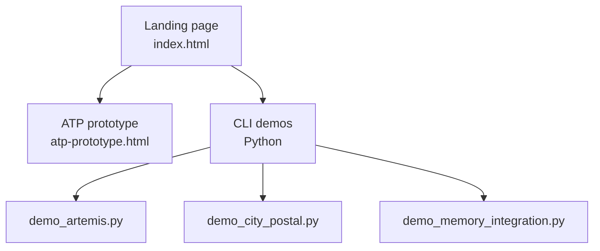

# Artemis City Concept Demos

Canonical home for the Governance Simulation Space demos. Deployable as a static site (Vercel or any static host) and runnable locally for the Python walk-throughs.

## Demo map



## Prerequisites
- Python 3.9+ (3.10+ recommended)
- `pip install -r requirements.txt` (from repo root)
- Optional for memory demo: `MCP_BASE_URL` and `MCP_API_KEY` set and MCP server running (`cd mcp-server && docker-compose up -d`)

## Browser prototype (static)
- Open `Governance_Simulation_Space/Concept_Demos/atp-prototype.html` in your browser, or serve locally:
  ```bash
  python -m http.server 8080
  open http://localhost:8080/Governance_Simulation_Space/Concept_Demos/atp-prototype.html
  ```
- Features shown: ATP header builder, trust-aware agent routing, activity log.
- Future/Hebbian/telemetry overlays are intentionally gated out in this demo build.

## Python CLI demos
Run from the repo root so imports resolve.

1) Artemis persona + ATP + reflection
```bash
python Governance_Simulation_Space/Concept_Demos/demo_artemis.py
```
Expected: step-through demos with prompts between sections.

2) City postal (mock-friendly)
```bash
python Governance_Simulation_Space/Concept_Demos/demo_city_postal.py
```
Expected: runs with mock postal + trust interfaces if memory layer is unavailable.

3) Memory integration (graceful when MCP missing)
```bash
python Governance_Simulation_Space/Concept_Demos/demo_memory_integration.py
```
Expected: if `MCP_BASE_URL`/`MCP_API_KEY` are unset or MCP is down, the script prints setup instructions and skips MCP-only flows while still running trust/decay sections.

## Deploy to Vercel (static)
```bash
vercel --prod Governance_Simulation_Space/Concept_Demos
```
- Framework: “Other”
- Output directory: `.`
- Result serves `index.html` and `atp-prototype.html`

## Canonical location
This folder is the single source of truth for the demos. Any other copies (e.g., `app/examples/atp-prototype.html`) simply point back here.
